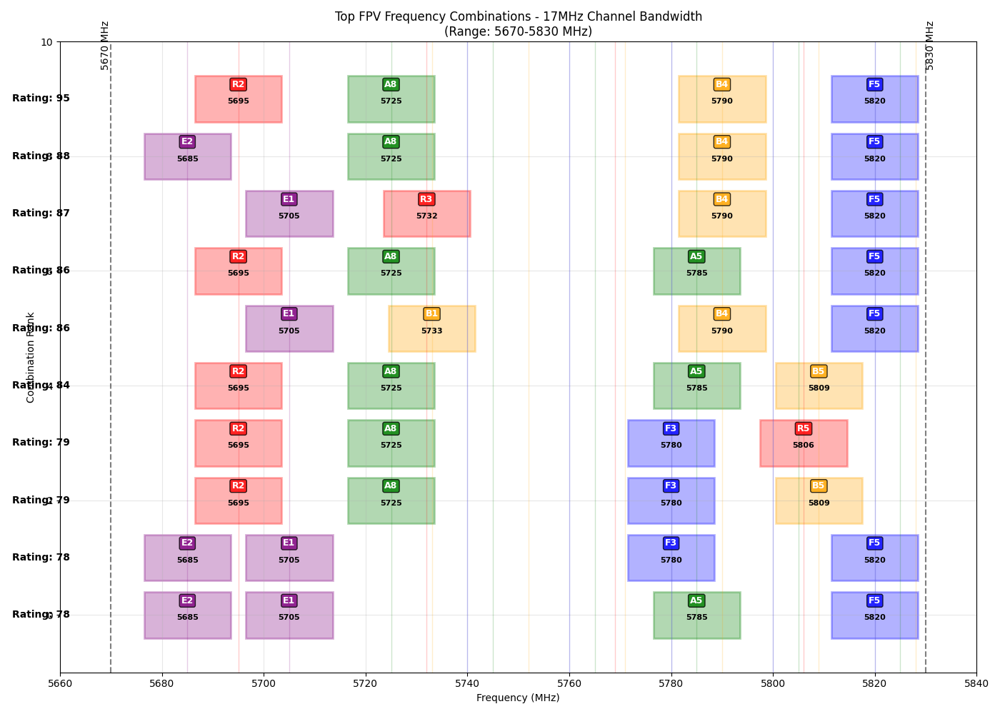

# IMD Avoider - FPV周波数最適化ツール

FPVドローンの複数機同時飛行時における相互変調歪み（IMD: Intermodulation Distortion）を最小化する周波数組み合わせを見つけるツールです。

## 最適化結果（アナログ/HDZero Narrow 17MHz）



### 上位10組の周波数組み合わせ

| Rank | Rating | Ch1 | Ch2 | Ch3 | Ch4 |
|------|--------|-----|-----|-----|-----|
| 1 | 95 | 5695(R2) | 5725(A8) | 5790(B4) | 5820(F5) |
| 2 | 88 | 5685(E2) | 5725(A8) | 5790(B4) | 5820(F5) |
| 3 | 87 | 5705(E1) | 5732(R3) | 5790(B4) | 5820(F5) |
| 4 | 86 | 5695(R2) | 5725(A8) | 5785(A5) | 5820(F5) |
| 5 | 86 | 5705(E1) | 5733(B1) | 5790(B4) | 5820(F5) |
| 6 | 84 | 5695(R2) | 5725(A8) | 5785(A5) | 5809(B5) |
| 7 | 79 | 5695(R2) | 5725(A8) | 5780(F3) | 5806(R5) |
| 8 | 79 | 5695(R2) | 5725(A8) | 5780(F3) | 5809(B5) |
| 9 | 78 | 5685(E2) | 5705(E1) | 5780(F3) | 5820(F5) |
| 10 | 78 | 5685(E2) | 5705(E1) | 5785(A5) | 5820(F5) |

※ 表記例: 5695(R2) = 5695 MHz, Raceband Channel 2

## 概要

このツールは、5.8GHz帯のFPV周波数から4つのチャンネルを選択し、相互変調歪みが最小となる組み合わせを計算します。標準的なFPVバンド（Raceband、Fatshark、Boscam A/B、Band E）から選択可能です。

## 特徴

- **複数の帯域幅モードに対応**
  - `analog`: 従来のアナログFPV (17 MHz)
  - `hdzero-narrow`: HDZeroナローモード (17 MHz)
  - `hdzero`: HDZero標準モード (27 MHz)
  - `dji`: DJIデジタルFPV (20 MHz)

- **周波数範囲**: 5670-5830 MHz内で使用可能な周波数を自動フィルタリング
- **IMD評価**: 3次相互変調（2×f1 - f2）を計算し、0-100のスコアで評価（高いほど良い）
- **視覚化**: 上位10組の結果をグラフで表示

## インストール

### uvを使用する場合（推奨）
```bash
# 依存関係のインストール
uv sync

# アプリケーションの実行
uv run python app.py [モード]
```

### pipを使用する場合
```bash
pip install matplotlib
python3 app.py [モード]
```

## 使用方法

```bash
# デフォルト（17 MHz アナログ/HDZeroナロー）
uv run python app.py

# HDZero標準モード（27 MHz）
uv run python app.py hdzero

# HDZeroナローモード（17 MHz）
uv run python app.py hdzero-narrow

# 従来のアナログ（17 MHz）
uv run python app.py analog

# DJIデジタル（20 MHz）
uv run python app.py dji
```

## 実行結果の例

```
Using analog mode with 17 MHz bandwidth
Total FPV frequencies: 39
Frequencies that fit entirely in range 5670-5830 MHz: 21
Available frequencies: [5685, 5695, 5705, 5725, 5732, 5733, 5740, 5745, 5752, 5760, 5765, 5769, 5771, 5780, 5785, 5790, 5800, 5805, 5806, 5809, 5820]
Channel edges: 5678.5 to 5821.5 MHz
Total combinations: 1126

Top 10 FPV frequency combinations:
1. Rating: 95 - 5695MHz(R2), 5725MHz(A8), 5790MHz(B4), 5820MHz(F5)
2. Rating: 88 - 5685MHz(E2), 5725MHz(A8), 5790MHz(B4), 5820MHz(F5)
3. Rating: 87 - 5705MHz(E1), 5732MHz(R3), 5790MHz(B4), 5820MHz(F5)
4. Rating: 86 - 5695MHz(R2), 5725MHz(A8), 5785MHz(A5), 5820MHz(F5)
5. Rating: 86 - 5705MHz(E1), 5733MHz(B1), 5790MHz(B4), 5820MHz(F5)
6. Rating: 84 - 5695MHz(R2), 5725MHz(A8), 5785MHz(A5), 5809MHz(B5)
7. Rating: 79 - 5695MHz(R2), 5725MHz(A8), 5780MHz(F3), 5806MHz(R5)
8. Rating: 79 - 5695MHz(R2), 5725MHz(A8), 5780MHz(F3), 5809MHz(B5)
9. Rating: 78 - 5685MHz(E2), 5705MHz(E1), 5780MHz(F3), 5820MHz(F5)
10. Rating: 78 - 5685MHz(E2), 5705MHz(E1), 5785MHz(A5), 5820MHz(F5)

================================================================================
Rank | Rating | Ch1        | Ch2        | Ch3        | Ch4        
--------------------------------------------------------------------------------
   1 |     95 | 5695(R2)   | 5725(A8)   | 5790(B4)   | 5820(F5)  
   2 |     88 | 5685(E2)   | 5725(A8)   | 5790(B4)   | 5820(F5)  
   3 |     87 | 5705(E1)   | 5732(R3)   | 5790(B4)   | 5820(F5)  
   4 |     86 | 5695(R2)   | 5725(A8)   | 5785(A5)   | 5820(F5)  
   5 |     86 | 5705(E1)   | 5733(B1)   | 5790(B4)   | 5820(F5)  
   6 |     84 | 5695(R2)   | 5725(A8)   | 5785(A5)   | 5809(B5)  
   7 |     79 | 5695(R2)   | 5725(A8)   | 5780(F3)   | 5806(R5)  
   8 |     79 | 5695(R2)   | 5725(A8)   | 5780(F3)   | 5809(B5)  
   9 |     78 | 5685(E2)   | 5705(E1)   | 5780(F3)   | 5820(F5)  
  10 |     78 | 5685(E2)   | 5705(E1)   | 5785(A5)   | 5820(F5)  
================================================================================
```

## 結果の見方

- **Rating**: IMD評価スコア（0-100、高いほど干渉が少ない）
- **周波数表記**: `5695MHz(R2)` = 5695 MHz（Raceband チャンネル2）
- **グラフ**: 各チャンネルの帯域幅と周波数配置を視覚的に表示

## 技術仕様

- **評価アルゴリズム**: 3次相互変調積（2×f1 - f2）が既存の周波数に近い場合にペナルティを与える
- **有効周波数範囲**: 5100-6099 MHz（imd.pyで定義）
- **最小チャンネル間隔**: チャンネル帯域幅 + 1 MHz

## ライセンス

このプロジェクトはオープンソースです。